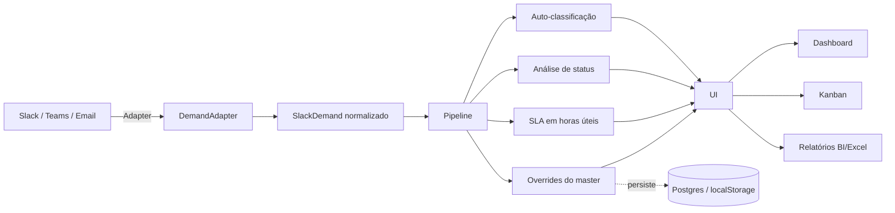

# FlowDesk

[](https://github.com/HugoJunioor/FlowDesk/actions/workflows/ci.yml)
[](https://flow-desk-e2is.vercel.app)
[](#stack)
[](LICENSE)

Sistema de gestão de demandas que chegam via Slack. Centraliza atendimentos
dispersos em conversas num painel gerencial com SLA, métricas, relatórios
BI/Excel e controle granular de permissões.

## 📸 Screenshots

### Dashboard executivo
Métricas em tempo real, gráficos por cliente, prioridade e SLA.


### Gestão de demandas (Kanban)
Cards com prioridade, SLA em horas úteis, classificação automática e ações rápidas.


### Classificação automática por IA
Cada demanda recebe prioridade sugerida com nível de confiança e *reasoning* explícito — auditável.


### Relatório BI interativo
Gera HTML autocontido com gráficos, timelines e análise por cliente, prioridade e canal.


### Grupos e permissões granulares
Matriz de 8 módulos × 5 ações por grupo, união automática quando o usuário pertence a vários.


### Login


## 🌐 Demo ao vivo

**🔗 [flow-desk-e2is.vercel.app](https://flow-desk-e2is.vercel.app)**

| Campo | Valor |
|---|---|
| Login | `master` |
| Senha | `Admin@1` |

A demo roda com dados fictícios (10 demandas com prioridades, SLAs e
clientes variados). Cada visitante tem seu próprio estado isolado no
navegador — pode criar usuários, mexer em overrides, exportar relatórios
sem afetar outros visitantes.

## 🏗 Arquitetura



Camadas desacopladas: **adapter** (fonte) → **pipeline** (lógica de
negócio) → **UI** (apresentação) → **storage** (persistência). Trocar
qualquer camada não afeta as outras.

## 🔌 Multi-canal

Sistema **não acoplado ao Slack**. A arquitetura suporta nativamente
qualquer plataforma de chat — basta criar um adapter de ~80 linhas.

| Canal              | Status     |
|--------------------|------------|
| Slack              | ✅ Produção |
| Microsoft Teams    | 📋 Stub pronto |
| Discord            | ⏳ Roadmap |
| WhatsApp Business  | ⏳ Roadmap |
| E-mail (IMAP)      | ⏳ Roadmap |
| Telegram           | ⏳ Roadmap |

Detalhes técnicos em [`src/adapters/README.md`](./src/adapters/README.md).

## Funcionalidades

- 📊 **Dashboard executivo** com métricas, gráficos por prioridade/cliente e
  visão anual mês a mês
- 📋 **Gestão de demandas** em lista, kanban, agrupamentos por data,
  prioridade ou responsável
- 🔄 **Sincronização automática** com Slack a cada 5 minutos
- ⏱ **SLA em horas úteis** (Seg-Sex 8-18, descontando feriados nacionais
  e municipais)
- 🗂 **Módulo isolado** para demandas técnicas com regras próprias
- 👥 **Grupos e permissões granulares** (8 módulos × 5 ações)
- 🌍 **Multi-idioma** (PT-BR, EN-US, ES-ES) por usuário
- 🎨 **16 temas de cores** com modo claro/escuro
- 📤 **Relatórios** em BI (HTML interativo) e Excel formatado
- 🔐 **Autenticação** por usuário com sessão de 8h e troca obrigatória
  no primeiro acesso
- 🔗 **Estado compartilhado** entre dispositivos via VPN/rede mesh

## Stack

- **Frontend:** React 18 + TypeScript + Vite + Tailwind CSS + shadcn/ui
- **Roteamento:** react-router-dom
- **Gráficos:** Recharts
- **Slack:** @slack/web-api
- **Excel:** xlsx-js-style
- **Forms:** react-hook-form + zod

## Pré-requisitos

- Node.js 18+
- npm
- Token de bot Slack com escopos: `channels:history`, `channels:read`,
  `groups:read`, `users:read`, `reactions:read`

## Instalação

```bash
git clone https://github.com/HugoJunioor/flowdesk.git
cd flowdesk
npm install --legacy-peer-deps
cp .env.example .env
# Edite .env com seu SLACK_BOT_TOKEN, SLACK_WORKSPACE e TEAM_MEMBERS
```

## Comandos disponíveis

| Comando | Descrição |
|---------|-----------|
| `npm run dev` | Servidor de desenvolvimento (porta 8080) |
| `npm run dev:vpn` | Dev + sync automático + lista IPs disponíveis |
| `npm run build` | Build de produção |
| `npm run preview` | Servir o build localmente |
| `npm run share` | Sync + build + preview + watcher (recomendado) |
| `npm run sync` | Sincronizar canais cliente-* manualmente |
| `npm run sync:sql` | Sincronizar canal de demandas técnicas |
| `npm run lint` | Linter ESLint |

## Acesso inicial

Após o primeiro `npm run dev`, acesse `http://localhost:8080` e entre com:

- **Login:** `master`
- **Senha:** `Admin@1`

O sistema vai exigir troca de senha imediata.

## Estrutura do projeto

```
src/
├── pages/         Telas (Dashboard, Demandas, SQL, Usuários, Grupos...)
├── components/    Componentes reutilizáveis
├── contexts/      Auth, Theme, Language
├── hooks/         Hooks customizados (usePermissions, etc)
├── lib/           Lógica de negócio (SLA, sync, i18n, storage)
├── data/          Dados sincronizados (gitignored)
├── types/         Tipos TypeScript
└── config/        Temas e branding

scripts/
├── syncSlack.cjs       Sync dos canais cliente-*
├── syncSqlChannel.cjs  Sync do canal técnico
├── stateSync.mjs       Plugin Vite para estado compartilhado
└── ...
```

## Configuração do Slack

O arquivo `.env` precisa de:

```env
SLACK_BOT_TOKEN=xoxb-...
SLACK_WORKSPACE=seu-workspace
TEAM_MEMBERS=["Nome Completo do Membro 1","Nome Completo do Membro 2"]
```

`TEAM_MEMBERS` é a lista de usuários internos. Mensagens de quem está
nesta lista são tratadas como "equipe"; o restante é tratado como cliente
externo.

## Privacidade

Este repositório contém **apenas código**. Os dados sincronizados
(demandas, usuários, históricos, tokens, nomes de funcionários e clientes)
são gerados localmente e estão excluídos do Git via `.gitignore`.

## Licença

Uso interno. Sem licença aberta.
